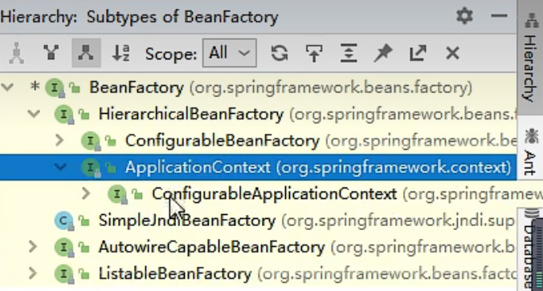
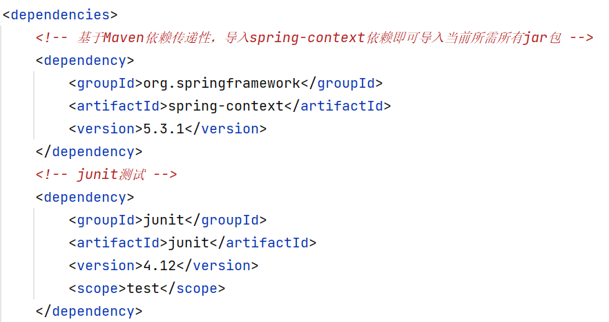

**IOC在Spring中的实现**

使用的API是ApplicationContext

使用类路径下的xml文件来进行ioc容器的获取，上面的filesystem是通过在磁盘的位置来访问的，但是我们的项目以后要供不同的人来使用，他们可能会把文件放在不同的位置，因此这种方法没有普遍性

1.引入dependencies

2.创建配置文件applicationContext
现在就可以开始配置bean的属性了：
id是唯一标识，想要管理一个特定的bean的时候，只需要告诉spring它的id就好了
class就是平时写java的时候的那个class，也叫类

这行就表示我把pojo包下面的Helloworld.class交给了spring管理，并且给这个文件起了个id叫Helloworld（注意：起什么id都可以，只不过这个比较适合）
