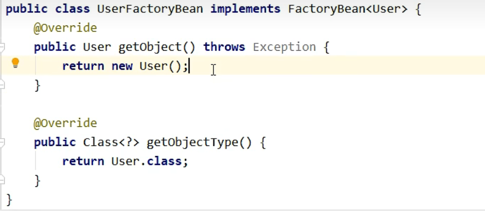

# Spring

### 1.1 ioc在Spring中的实现


使用的API是ApplicationContext


ClassPathXml是使用类路径下的xml文件来进行ioc容器的获取，上面的FileSystemXml是通过在磁盘的位置来访问的，但是我们的项目以后要供不同的人来使用，他们可能会把文件放在不同的位置，因此这种方法没有普遍性


1.引入dependencies
```xml
    <dependencies>
        <!-- 基于Maven依赖传递性，导入spring-context依赖即可导入当前所需所有jar包 -->
        <dependency>
            <groupId>org.springframework</groupId>
            <artifactId>spring-context</artifactId>
            <version>5.3.1</version>
        </dependency>
        <!-- junit测试 -->
        <dependency>
            <groupId>junit</groupId>
            <artifactId>junit</artifactId>
            <version>4.12</version>
            <scope>test</scope>
        </dependency>
    </dependencies>
```

2.创建配置文件applicationContext
现在就可以开始配置bean的属性了：
id是唯一标识，不能重复，想要管理一个特定的bean的时候，只需要告诉spring它的id就好了
class就是平时写java的时候的那个class，也叫类
```xml
<bean id="helloworld" class="com.atguigu.spring.pojo.HelloWorld"></bean>
```
这行就表示我把pojo包下面的Helloworld.class交给了spring管理，并且给这个文件起了个id叫Helloworld（注意：起什么id都可以，只不过这个比较适合）

#### 创建一个test类来测试一下吧！
```java
public class test{
    @Test
    public void test(){
        //获取ioc容器
        ApplicationContext ioc = new ClassPathXmlApplicationContext("applicationContext.xml");
        //获取bean对象，这个方法我用的是byname，也就是bean的id，也正是因为用的id，所以不知道bean的类型，因此需要强转
        HelloWorld HehlloWorld = (HelloWorld)ioc.getBean("helloworld");
        HehlloWorld.sayHello();
    }
}
```
### 1.2 通过DI来赋值
为成员变量赋值有两种方法，一是set方法，另一个是有参构造，在spring里面也一样
```xml
<!--方法一-->
<bean id="student" class="pojo.student">
   <property name="name" value="Shiwen"></property>
</bean>
<!--方法二-->
<bean id="student" class="pojo.student">
    <constructuor-arg value="Shiwen"></constructuor-arg>
</bean>
```
#### 为类类型的属性赋值
因为class不可以像成员变量一样直接赋值（不可以用value了），两种解决办法
1. 外部bean先设置好value，再用ref来引用这个bean
```xml
<bean id="student" class="pojo.student">
   <property name="class" ref="'classone"></property>
</bean>

<bean id="class" class="pojo.class">
    <property name="amount" value="60"></property>
</bean>
```
2. 也可以通过内部bean来赋值，注意内部bean只能在bean的内部使用，无法通过ioc容器来获取
```xml
<bean id="student" class="pojo.student">
   <property name="class">
      <bean id="class" class="pojo.class">
         <property name="amount" value="60"></property>
      </bean>
   </property>
</bean>
```
这个是报的错误


### 1.3 factory bean


不需要配置User，直接在xml里面配置beanfactory，通过beanfactory的get object方法也可以得到User

### 1.4 自动装配
有了自动装配，就不需要像上文一样找到对应的bean的id来为类类型的属性赋值了
如果不使用自动装配
```xml
<bean id="userService" class="offer.userService">
    <property name="userDao" ref="userDao"></property>
</bean>
<bean id="userDao" class="offer.userDao"></bean>
```
_通过xml实现自动装配_
1. byType
```xml
<bean id="userService" class="offer.userService" autowire="byType">
    <property name="userDao" ref="userDao"></property>
</bean>
<bean id="userDao" class="offer.userDao" autowire="byType"></bean>
```
_基于注解来管理bean_

1.添加注解
```java
@Compontent
@Controller
@Service
@Repository
```
2.扫描
```xml
<context:component-scan base-package="offer"> 
</context:component-scan>
```

3.不基于xml，可以使用@Autowired
```java
//直接把它加到成员变量上即可
@Controller
public class UserController{ 
    @Autowired
    private UserService userService;
    public void saveUser(){
        userService.saveUser();
    }
}
```

### 2.1 aop相关术语
1.横切关注点：即非核心业务代码，例如计算器例子中的日志功能
2.切面：封装横切关注点的类
3.通知：和横切关注点是一样的东西，相对于切面来讲就叫通知

例子：
1.创建目标类和切面类并且交给ioc管理
```java
//目标类
@Component
public class CalculatorImpl implements Calculator {
    @Override
    public int add(int i, int j) {
        int result = i + j;
        System.out.println("方法内部，result："+result);
        return result;
    }

    @Override
    public int sub(int i, int j) {
        int result = i - j;
        System.out.println("方法内部，result："+result);
        return result;
    }

    @Override
    public int mul(int i, int j) {
        int result = i * j;
        System.out.println("方法内部，result："+result);
        return result;
    }

    @Override
    public int div(int i, int j) {
        int result = i / j;
        System.out.println("方法内部，result："+result);
        return result;
    }
}

//切面类
@Component
@Aspect //将当前组件标识为切面
public class LoggerAspect {

   @Pointcut("execution(* com.atguigu.spring.aop.annotation.CalculatorImpl.*(..))")
   public void pointCut() {
   }

   //@Before("execution(public int com.atguigu.spring.aop.annotation.CalculatorImpl.add(int, int))")
   //@Before("execution(* com.atguigu.spring.aop.annotation.CalculatorImpl.*(..))")
   @Before("pointCut()")
   public void beforeAdviceMethod(JoinPoint joinPoint) {
      //获取连接点所对应方法的签名信息
      Signature signature = joinPoint.getSignature();
      //获取连接点所对应方法的参数
      Object[] args = joinPoint.getArgs();
      System.out.println("LoggerAspect，方法：" + signature.getName() + "，参数：" + Arrays.toString(args));
   }

   @After("pointCut()")
   public void afterAdviceMethod(JoinPoint joinPoint) {
      //获取连接点所对应方法的签名信息
      Signature signature = joinPoint.getSignature();
      System.out.println("LoggerAspect，方法：" + signature.getName() + "，执行完毕");
   }

   /**
    * 在返回通知中若要获取目标对象方法的返回值
    * 只需要通过@AfterReturning注解的returning属性
    * 就可以将通知方法的某个参数指定为接收目标对象方法的返回值的参数
    */
   @AfterReturning(value = "pointCut()", returning = "result")
   public void afterReturningAdviceMethod(JoinPoint joinPoint, Object result) {
      //获取连接点所对应方法的签名信息
      Signature signature = joinPoint.getSignature();
      System.out.println("LoggerAspect，方法：" + signature.getName() + "，结果：" + result);
   }

   /**
    * 在异常通知中若要获取目标对象方法的异常
    * 只需要通过AfterThrowing注解的throwing属性
    * 就可以将通知方法的某个参数指定为接收目标对象方法出现的异常的参数
    */
   @AfterThrowing(value = "pointCut()", throwing = "ex")
   public void afterThrowingAdviceMethod(JoinPoint joinPoint, Throwable ex) {
      //获取连接点所对应方法的签名信息
      Signature signature = joinPoint.getSignature();
      System.out.println("LoggerAspect，方法：" + signature.getName() + "，异常：" + ex);
   }

   @Around("pointCut()")
   //环绕通知的方法的返回值一定要和目标对象方法的返回值一致
   public Object aroundAdviceMethod(ProceedingJoinPoint joinPoint) {
      Object result = null;
      try {
         System.out.println("环绕通知-->前置通知");
         //表示目标对象方法的执行
         result = joinPoint.proceed();
         System.out.println("环绕通知-->返回通知");
      } catch (Throwable throwable) {
         throwable.printStackTrace();
         System.out.println("环绕通知-->异常通知");
      } finally {
         System.out.println("环绕通知-->后置通知");
      }
      return result;
   }
}
```
