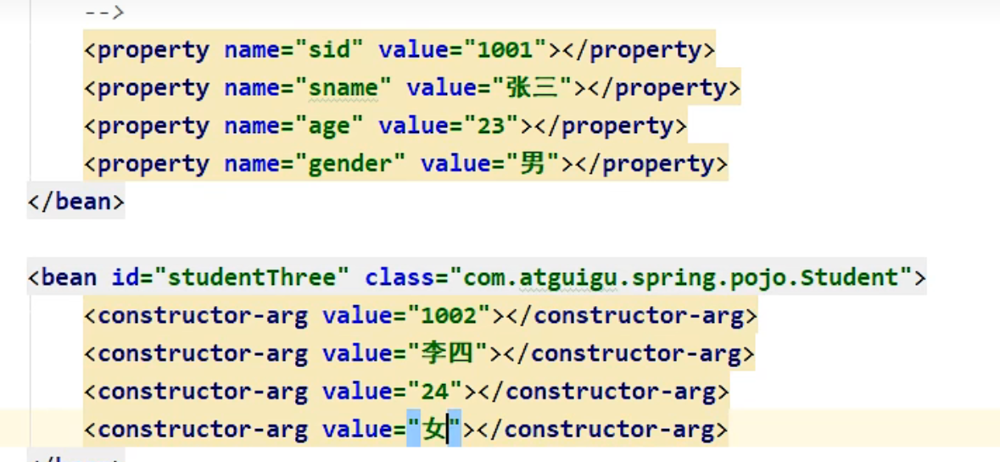
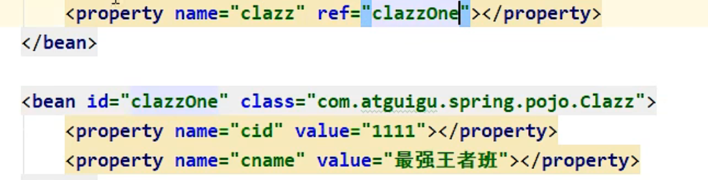
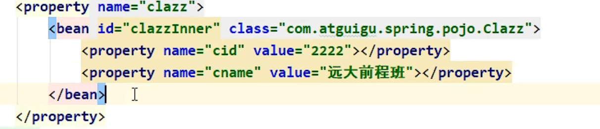
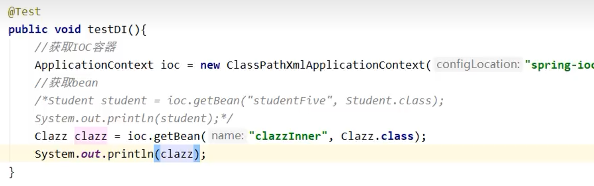
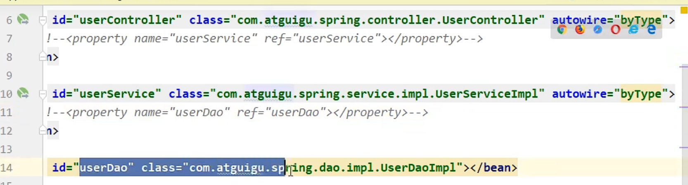
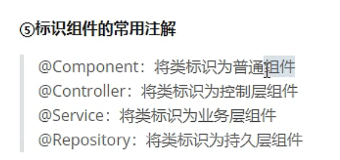

**IOC在Spring中的实现**


使用的API是ApplicationContext


使用类路径下的xml文件来进行ioc容器的获取，上面的filesystem是通过在磁盘的位置来访问的，但是我们的项目以后要供不同的人来使用，他们可能会把文件放在不同的位置，因此这种方法没有普遍性


1.引入dependencies


2.创建配置文件applicationContext
现在就可以开始配置bean的属性了：
id是唯一标识，不能重复，想要管理一个特定的bean的时候，只需要告诉spring它的id就好了
class就是平时写java的时候的那个class，也叫类

这行就表示我把pojo包下面的Helloworld.class交给了spring管理，并且给这个文件起了个id叫Helloworld（注意：起什么id都可以，只不过这个比较适合）


**IOC在Spring中的实现的测试**
创建一个test类来测试一下吧！
```java
public class test{
    @Test
    public void test(){
        //获取ioc容器
        ApplicationContext ioc = new ClassPathXmlApplicationContext("applicationContext.xml");
        //获取bean对象，这个方法我用的是byname，也就是bean的id，也正是因为用的id，所以不知道bean的类型，因此需要强转
        HelloWorld HehlloWorld = (HelloWorld)ioc.getBean("helloworld");
        HehlloWorld.sayHello();
    }
}
```
**通过DI来赋值**

为成员变量赋值有两种方法，一是set方法，另一个是有参构造，在spring里面也一样


**为类类型的属性赋值**
1. 
因为class是一个类型，没办法像上个例子那样直接用value来赋值，可以先用外部的bean来赋值，然后再用ref来引用bean
2. 
也可以通过内部bean来赋值，注意内部bean只能在bean的内部使用，无法通过ioc容器来获取
   
   

**factory bean**


不需要配置User，直接在xml里面配置beanfactory，通过beanfactory的get object方法也可以得到User

**自动装配**
有了自动装配，就不需要像上文一样找到对应的bean的id来为类类型的属性赋值了
如果不使用自动装配

_通过xml实现自动装配_
1. byType

_基于注解来管理bean_
    
   
   配置注解并扫描

